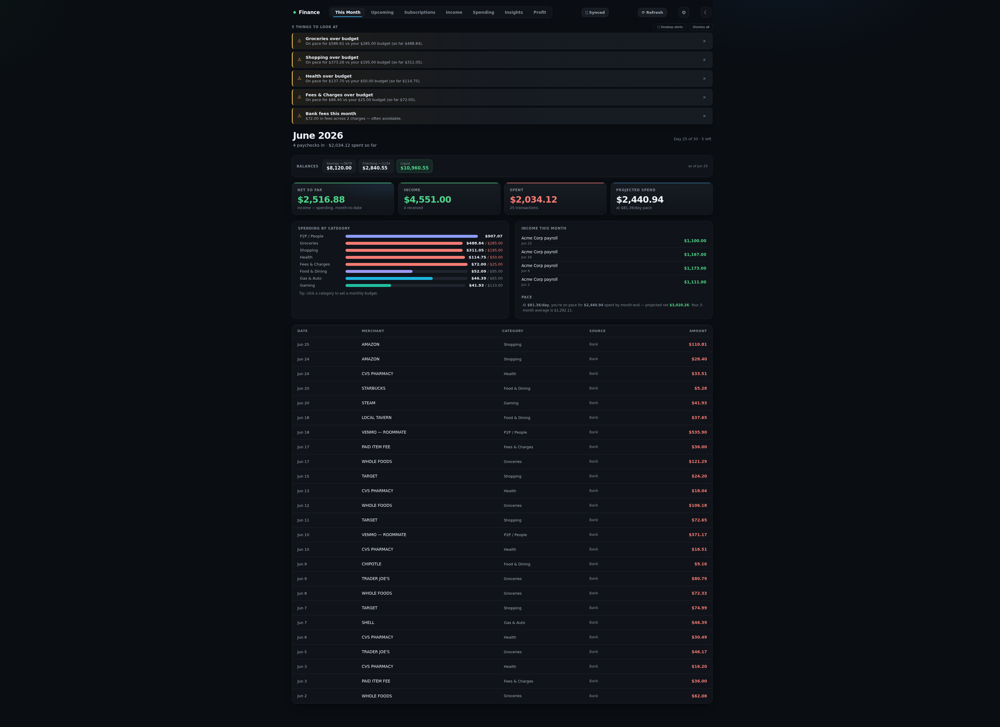
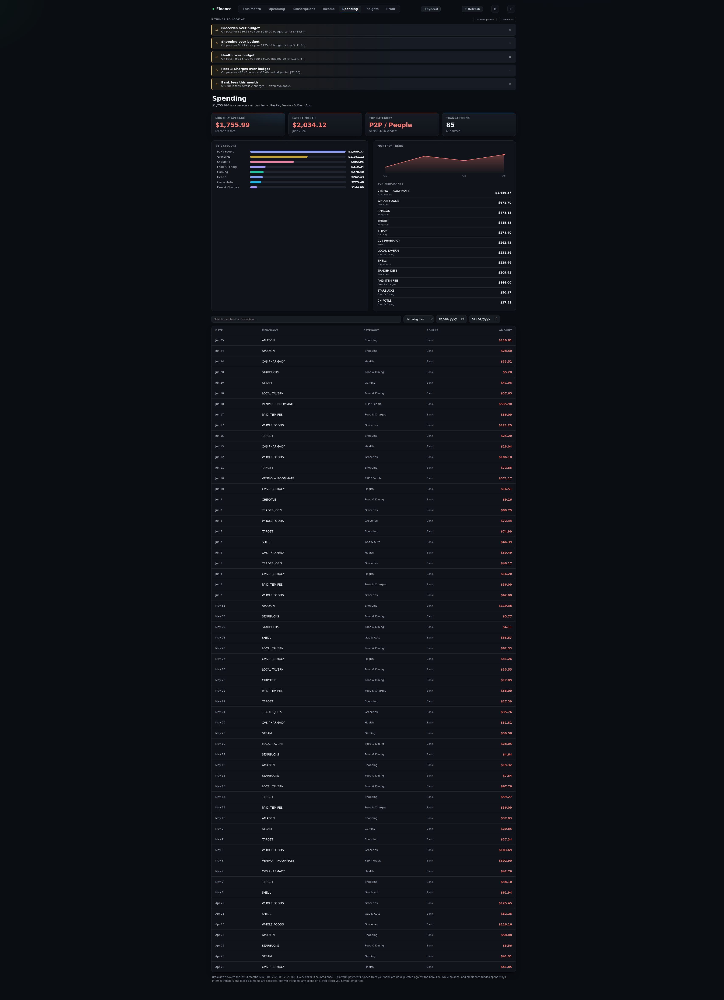

# 💰 Finance Tracker

A **local-first, self-hosted** personal finance dashboard. See every account,
subscription, paycheck, and dollar in one place — with optional **real-time bank
sync**. Your financial data never leaves your machine.

No accounts. No cloud. No tracking. **Zero npm dependencies** — it runs on Node's
built-in SQLite and HTTP server, with a plain HTML/CSS/JS front-end.



## What it does

Seven tabs over your real money:

- **This Month** — live balances, income vs spending so far, a pace projection, and budgets
- **Upcoming** — projects your subscription charges against your paychecks; warns you *before* an overdraft
- **Subscriptions** — every recurring charge, normalized to weekly / monthly / yearly
- **Income** — a paycheck ledger with YTD totals and run-rate
- **Spending** — categorized across every source, with a trend chart and top merchants
- **Insights** — month-over-month shifts, where your peer-to-peer money goes, and a fee/leak finder
- **Profit** — income minus *all* spending = your true take-home



Across every tab, an **Alerts** bar surfaces what needs attention — a projected
overdraft, a category about to blow its budget, a big charge landing this week, or
a recurring charge you're not tracking yet — with opt-in desktop notifications.
Set **budgets** in one click from your own 3-month average, then watch the pace.

Plus: light/dark theme, editable categories that stick, an in-app re-import, and
a modern animated UI.

## Where the data comes from

| Source | How |
|--------|-----|
| **Bank (checking, savings, cards)** | 🟢 **Real-time** via [SimpleFIN](https://www.simplefin.org/) — connect once, it auto-syncs balances + transactions |
| PayPal, Venmo, Cash App, anything else | 📄 Manual — drop CSV/statement exports into `import/` and hit Refresh |

> **SimpleFIN costs ~$15/year**, paid directly to SimpleFIN — not to this project,
> which is free and open-source. It's optional: you can run entirely on manual CSV
> imports for free. SimpleFIN is read-only and your bank credentials never touch
> this app.

## Quick start

Requires **Node 22.5+** (for built-in `node:sqlite`).

```bash
git clone https://github.com/Michael-WhiteCapData/finance-tracker.git
cd finance-tracker
npm start
```

Open **http://localhost:4317**. The first run shows an onboarding screen — connect
a bank, or import statements. The server binds to `127.0.0.1` only (it's not
reachable from your network).

**Windows:** double-click `start-finance.bat`.

### Try it with demo data first

```bash
npm run demo
```

Seeds a separate `demo.db` with realistic fake data and starts the server against
it — your real `finance.db` is never touched. Works on macOS, Linux, and Windows.

### Keeping it running

- **macOS/Linux:** run `npm start` under your process manager of choice
  (`systemd --user`, `launchd`, `pm2`, or a `tmux` session).
- **Windows:** run `powershell -ExecutionPolicy Bypass -File scripts/install-autostart.ps1`
  to register a hidden Scheduled Task that starts the app at logon.

## Connecting your bank (SimpleFIN)

1. Sign up at [bridge.simplefin.org](https://bridge.simplefin.org) and connect your accounts
2. Generate a **Setup Token**
3. In the app, click **🔗 Connect bank**, paste the token, and **Connect & sync**

That's it — balances and transactions flow in, and **Refresh** re-syncs anytime.

## Importing statements manually (free)

Export CSVs from your bank / PayPal / Venmo / Cash App and drop them in `import/`,
then hit **Refresh**. The importer auto-detects files, categorizes transactions,
and de-duplicates payments funded across accounts so each dollar is counted once.

## Privacy

- **Local-first, no cloud backend.** Your data lives in `finance.db` on your machine.
  This app never sends your data to any server we run — there is no server we run.
- The **only** outbound network call is the optional SimpleFIN sync, which goes
  **directly from your machine to SimpleFIN** to fetch your balances/transactions.
  Skip it and the app makes no network calls at all.
- `finance.db` and `import/` are **git-ignored** — they never get committed.
- SimpleFIN access is **read-only** and stored only in your local database.
- The server listens on **localhost only** by default (no auth — keep it that way;
  binding to the LAN requires your own reverse proxy with authentication).

## Tech

Node 22.5+ · `node:sqlite` · `node:http` · vanilla HTML/CSS/JS. No framework, no
build step, no dependencies. See [`CLAUDE.md`](CLAUDE.md) for the architecture map
and [`CONTRIBUTING.md`](CONTRIBUTING.md) to help out.

## License

[MIT](LICENSE) © 2026 Michael Tierney
